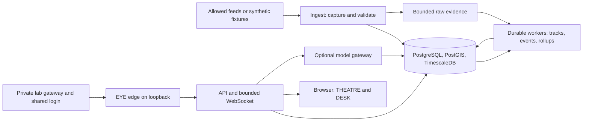

# EYE public repository build brief

*28 September 2026. Source code will be public on GitHub. The owner's running instance stays private behind the Home Lab tunnel. This is the self-contained implementation brief to copy into a new public repository; `eye-rev1.md` remains the private design history. A public synthetic build of EYE now exists: the packages merged so far are listed in the repository README. It runs on invented data only; no real feed, private installation or production deployment exists yet.*

## 1. What success means

Build a self-hosted geospatial and solar-system observation and research application with two views: THEATRE, a responsive 3D globe and optional solar-system view, and DESK, a source-aware analysis view. It may describe observations, coverage, uncertainty and testable hypotheses. It must never present a missing feed as zero activity or an untested correlation as a forecast. It has no broker connection, trade recommendation or person-tracking feature.

The public repository must build and run a **synthetic demo** without credentials, paid APIs, the owner's server or private configuration. Real adapters are opt-in. A local developer can start the demo, run tests, and see representative flight/vessel tracks, a road event, a coverage gap, a late correction, and a replayed event. The private production instance uses the lab's gateway, access matrix and shared login. A green GitHub CI run is evidence for the public code; it is **not** proof of that private integration.

**Release priority: accuracy before appearance, coverage or frame rate.** If a source cannot support a claimed position, time or dimension, EYE must show uncertainty, visibly label an approximation, or omit that layer. A photorealistic image cannot be presented as measured geometry merely because it looks convincing. Cinematic post-processing may change colour and style, never stored coordinates, object size, eclipse contact times or the result of a measurement tool. The default analytical view exposes source and error information.

### Architecture in plain English

Small collectors fetch source data and record exactly what was received. A database keeps observations, coverage and the rules used to derive events. Workers turn observations into tracks, counts and research results. A server gives the browser bounded snapshots and updates. The browser draws the globe and explains where every displayed result came from. A private gateway checks a person's access before any request reaches the server.



## 2. Public/private boundary

| Public GitHub repository | Owner's private deployment |
|---|---|
| Source, tests, migrations, synthetic fixtures, example configuration, data-source policy register, generic deployment templates, security and recovery procedures, the chosen backup provider class (Google Drive) | Provider credentials, real observations, personal holdings, session/password stores, certificate keys, access matrix, actual host/network settings, backup keys, account identifiers and folder paths |
| An `AuthPort` interface and fake implementation for local tests | `lablogin` and `lab-eligible` adapter from the private lab serving contract; no copy of that shared module |
| Loopback-only demo mode with synthetic data | Configured private HTTPS hostname through the one lab gateway |

Never copy the Home Lab root, server documents, private audit artifacts or cloud-sync history into the new repository. Create the public repository from an **empty directory** and copy only reviewed files. A `.gitignore` is a convenience, not the disclosure boundary. Before the first push, review the exact tracked-file list and every commit. Enable GitHub secret scanning and push protection; those are backstops, not substitutes for review ([GitHub documentation](https://docs.github.com/en/code-security/concepts/secret-security/push-protection)).

The owner's stated choice is **public source visibility**, with no reuse licence selected yet. Package 0 can omit `LICENSE` and say clearly in the README that reuse rights have not been granted. [GitHub explains](https://docs.github.com/en/repositories/managing-your-repositorys-settings-and-features/customizing-your-repository/licensing-a-repository) that a public repository without a licence can still be viewed and forked on GitHub, while ordinary reuse rights are not granted by a project licence. Do not label it open source or accept outside contributions under an assumed licence. Add a project licence only after the owner chooses one; third-party notices remain separate.

Public code does not imply public data or public deployment. Do not add an anonymous internet route, public demo backed by the owner's server, or a default exposed API. The synthetic demo binds to loopback. Its fake auth must refuse to start when production mode is selected; there is no production fallback if the shared lab auth adapter is absent. A future public hosted service needs a separate threat model, data licences, capacity budget and deployment decision. GitHub Actions receive no production secrets or server deployment key, and PRs never auto-deploy.

## 3. Product and process boundaries

Use one public repository with `web`, `api`, `ingest`, `worker`, optional `raster`, shared wire schema, migrations, deployment files and tests. The browser owns rendering and user interaction. The API owns authenticated queries and bounded subscriptions; it cannot write ingest history. Ingest owns provider credentials and append-only capture; it cannot serve users. Workers own derivations and retention; the raster worker has its own memory/scratch budget and no model or login secrets. The database is private to these services and has no published port.

### Optional AI: separate build tool from runtime feature

Claude cloud sessions are a **coding tool** funded by the owner's cloud credits. They are not the model backend for a deployed EYE. The deployed AI feature is optional: it may summarize bounded evidence packets and narrate source-qualified scenes, but ephemerides, geometry, physical scale, event outcomes and coverage decisions come from deterministic code and approved evidence. The core application works when AI is off. No runtime model or provider credential is chosen or installed by package 0.

All EYE runtime model calls go through a disabled-by-default `eye-brain` gateway with a versioned task-to-model policy, evidence validation, preflight quota/budget refusal, an append-only request ledger and visible failure states. The public demo uses recorded or mock responses and never needs a provider account. Model output is untrusted prose: it cannot edit an observation, assert an unsupported crash/protest/crowd count, or command the renderer to fabricate a measured fact. Give an AI answer its evidence IDs, time, scope and uncertainty; refuse unsupported claims.

For the owner's **Google AI Pro** idea, the conditional subscription adapter is **Antigravity CLI (`agy`) in headless mode**, not Gemini CLI. [Google ended consumer AI Pro/Ultra service through Gemini CLI on 18 June 2026](https://developers.googleblog.com/an-important-update-transitioning-gemini-cli-to-antigravity-cli/). The Gemini website is an interactive product and is not an EYE backend. [Google documents Antigravity headless operation](https://www.antigravity.google/docs/cli/headless/), but this alone does not establish that a personal subscription may serve a multi-user app. The adapter is owner-role only until current terms and data handling for that exact use are recorded. Invited users can use EYE's deterministic features without that account. The [Gemini API has its own free and paid tiers](https://ai.google.dev/gemini-api/docs/billing/); AI Pro does not supply a paid API budget. A separate API adapter can be added later under its own terms and caps.

The Antigravity adapter requires an account quota reader, a host-wide per-provider lock shared with any other local Antigravity use, distinct `SIGNED OUT`/`QUOTA EXHAUSTED`/`STALE` states, and a conservative refusal when quota data is missing. [AI credits may fund Antigravity overage](https://support.google.com/googleone/answer/14534406?hl=en), so set the account's overage choice to `Never` for no-extra-spend operation and record periodic checks; a local process cannot enforce an external setting it cannot read. [Headless Antigravity allows workspace file access by default](https://www.antigravity.google/docs/cli/headless/) and [sandboxed commands may run without approval](https://www.antigravity.google/docs/cli-permissions). Keep this adapter **off** until a documented tool-capability control disables all agent tools, an isolated runtime exposes no EYE data or command target, network access is restricted to required provider endpoints, and independent injection fixtures show no tool steps or side effects while an ordinary briefing succeeds. A prompt saying “do not use tools” or `--sandbox` alone does not pass that gate. Do not use `--dangerously-skip-permissions`.

The installed Antigravity binary is also a pinned dependency: the server release records its version and checksum, an exact-artifact reinstall/rollback procedure, and proof that updates cannot silently replace it. [Google's documented installer](https://antigravity.google/docs/cli/install/) does not describe a version-selection flag, so do not assume `curl ... | bash` gives a reproducible release. If the pin cannot be established, leave this adapter off.

### Storage profiles

Plan the private deployment for a **256 GB live EYE quota**, including 40 GB reserved for recovery and bursts. The owner can allow up to **500 GB live**, only after measured growth justifies an updated allocation, host free-space check and backup/restore-capacity review. A **100 GB reduced regional profile** is optional, not the chosen full deployment target. Account for every EYE write path, including database indexes/WAL, deployment images, logs, scratch and cache. At any quota, pause optional acquisition before the reserve is consumed, report the coverage gap, and delete history only after the checked derivation/backup transition. A week of real capture plus a burst must justify increasing retention or quota. Extensive global high-resolution city/imagery archives can exceed even 500 GB and then need selective regions or on-demand access. Google Drive is the initial independent off-site destination class for irreplaceable records; the actual account, quota and usage are private deployment configuration, to be measured before capture. This is **Google One consumer storage, not Google Cloud Storage**. The backup is additional to the live quota and must not be another partition on the same server disk. Size a full encrypted EYE restic repository plus retained generations, server staging and client scratch, and prove restoration from the *downloaded Drive copy*. The client alone holds Drive credentials; a dedicated forced-command key pulls encrypted ciphertext from the server. An unreachable-server skip or full Drive quota must make backup age stale and alert independently. The existing private mirror is destination-specific and needs a reusable destination-aware engine. The 24-hour recovery point and four-hour restore targets remain unproved until measured. The public synthetic demo remains small and downloads no global dataset by default.

**Backup destination contract:** keep the encrypted restic export, generation manifest, remote
verification and restore path independent of the destination backend. A private target table
supports `drive` now and `removable` later; one enrolment command adds an external SSD without
editing source or disturbing Drive history. Mounting that enrolled SSD triggers the ordinary
locked backup routine on Mac or Linux; unrelated drives do nothing. An SSD target must match its enrolled device identity
and marker before writing, and must refuse a missing, wrong, read-only or full mount rather than
creating a same-named folder on the client's internal disk. Report each target's backup age and
restore status separately. The SSD is initially an optional second copy; it may replace Drive as
the required independent target only after its physical location, connection schedule, capacity,
daily freshness and timed restore are proved. A disconnected SSD cannot claim a 24-hour recovery
point without a matching routine.

Choose the SSD filesystem when the drive is enrolled, record it privately and require an actual
restic restore from the SSD on both Mac and a replacement Linux client. exFAT is a portability
candidate with no journal or POSIX permissions; an unsafe unplug can corrupt older generations,
and restic cannot make the filesystem power-loss safe. After each SSD write, flush, remount,
check and restore a fixture before marking the generation verified. Schedule a full
`restic check --read-data`; after an unclean disconnect, require a filesystem check and full
data read plus restore before trusting or pruning the SSD. A native filesystem is acceptable
only with a rehearsed recovery path on the other OS. Keep Drive active while SSD recovery is
unproved.

Baseline implementation choices: TypeScript + CesiumJS in the browser; Python for API, ingestion and workers; PostgreSQL + PostGIS for spatial records; TimescaleDB only after its exact edition, feature set, licence and restore path are recorded. PostgreSQL native partitioning is the escape path if a required Timescale feature or licence is unsuitable. The backend and frontend use **one versioned wire schema** with generated types and runtime validation on both sides. Pin actual versions and image digests in the implementation PR; do not guess them in this plan.

### Proposed public repository layout

```text
eye/
  README.md                 public setup, demo, status, limitations
  CLAUDE.md                 task boundaries and mandatory gates below
  LICENSE                  optional; add only after the owner's licence decision
  NOTICE.md                upstream code/assets and attribution register
  docs/                    this brief, threat model, data-source policies, ADRs, recovery
  web/                     THEATRE and DESK
  backend/eye/api/         HTTP, WebSocket, auth interface
  backend/eye/ingest/      provider adapters and capture scheduler
  backend/eye/worker/      replay, events, rollups, research, retention
  backend/eye/raster/      optional isolated imagery pipeline
  schemas/                 authoritative wire definitions and version fixtures
  migrations/              reviewed forward and restore instructions
  deploy/dev/              loopback synthetic demo
  deploy/lab/              generic adapter templates, no real lab values
  tests/fixtures/          synthetic data and known-answer outputs
  scripts/                 one-command setup, verify, backup, restore drill
```

## 4. Data contract and failure behavior

Every observation carries a stable id, source, source record id where available, observed time, received time, geometry/position, schema and adapter version, capture batch id, quality flags and raw-evidence reference. A source identifier is an observed attribute, not proof of physical identity. Source timestamps and server receipt times never share a column.

Model the world as a **catalogue of independently sourced layers**, not one opaque globe. Each layer declares its area and time coverage, geometric resolution, coordinate/height datum, update interval, observation latency, published accuracy, licence, confidence and fallback. Terrain, building meshes, vegetation, weather, traffic, vessels, aircraft, satellites and reported events may have different ages and quality at the same camera position. A coverage query returns these properties for the selected place/time; UI legends and measurement tools reflect them. Detail streams by area, time and level of detail with strict budgets. Visual tiles may be simplified for speed, while analytic measurements use the best approved geometry and its uncertainty. Never imply that an uncatalogued tree, vehicle or incident is present, absent or precisely located.

Each attempted capture records: requested area/time, start/end, provider status, quota cost, observed interval, expected interval, number accepted/rejected, evidence checksum and a coverage state: `qualified`, `partial`, `unknown`, or `failed`. A feed outage makes coverage `unknown`/`failed` and metrics null; it does not insert zero. Every API response and chart point that depends on observations carries source, interval, coverage, derivation version and freshness.

Capture and derivation are replayable. First archive a bounded raw batch with checksum and manifest, then commit parsed records with deterministic keys; a crash between these steps leaves a discoverable pending batch. Workers claim durable jobs with short transactions, leases, bounded retries and idempotent output keys. PostgreSQL `FOR UPDATE SKIP LOCKED` is a claim method, not the whole queue. A worker never keeps a DB transaction open during a provider call or model request. A restart replays pending work and cannot double-count a transit.

Retention is a checked state transition. Before dropping a raw partition, prove all required derivations complete, their manifests still match, and irreplaceable outputs plus referenced evidence exist in a verified independent backup. A failed check blocks deletion. Raw high-rate history, derived aggregates and caches have separate policies. Quota pressure pauses the least important work first and publishes a coverage gap if capture must stop.

### Space and solar-system contract

The space catalogue has stable object IDs, object class, parent body, official designation and aliases. Support the Sun, planets, dwarf planets and major natural moons as the initial solar-system scene; add asteroids, comets, more moons and known spacecraft by search/on-demand selection. Earth-orbiting spacecraft/debris are a separate catalogue and propagation path. A distant-sky background may display stars or galaxies from a separately approved catalogue; they are **outside** the solar-system model. Millions of small bodies and Earth-orbiting objects are queried and aggregated by level of detail, not animated all at once.

Every returned space state includes target, observer, timestamp, time scale, coordinate frame, position, velocity when available, orientation **only when supported**, valid interval, source/model and revision, freshness and an accuracy/uncertainty label. Never call a propagated orbit “live telemetry.” Distinguish geometric and apparent observer positions. The API normalizes to a documented internal inertial frame and units; a boundary module handles UTC versus dynamical time, leap seconds, Earth-fixed coordinates, body-fixed frames and SGP4's TEME frame. Prevent mixing kilometres and metres or parent-relative and solar-system-barycentric positions. Modelled body rotation is different from a spacecraft's actual attitude: display `unknown` if no attitude source exists.

**Prediction is source-specific.** For the Moon, Sun and planets, evaluate a versioned dynamical ephemeris at the requested instant; the source need not publish a new Moon position every second or hour. Do not turn two hourly samples into a supposed physical orbit with straight-line interpolation. The ephemeris has a validity interval and an error budget. Earth satellites use a versioned GP/OMM element set and SGP4, with age, maneuvers and decay limiting useful prediction. Aircraft and vessels can show a short, explicitly estimated continuation from last speed/course, but it expires quickly and never counts as an observation. Clouds, fires and city details cannot be made current by orbital mechanics. Every displayed state is typed `observed`, `ephemeris`, `propagated`, `estimated` or `illustrative`; the UI and API expose the type and timestamp.

[JPL Horizons](https://ssd.jpl.nasa.gov/horizons/manual.html) supports ephemerides for the Sun, planets, natural satellites, many asteroids/comets and some spacecraft; use the official API or pinned local [NAIF SPICE kernels](https://naif.jpl.nasa.gov/naif/data_generic.html), cached with source hashes and coverage intervals. SPICE [SPK/PCK/CK kernels](https://naif.jpl.nasa.gov/pub/naif/toolkit_docs/C/req/kernel.html) describe position, body orientation and spacecraft attitude respectively; a CK is needed before claiming an actual spacecraft orientation. [CelesTrak GP data](https://celestrak.org/NORAD/documentation/gp-data-formats.php) should be ingested in an OMM-compatible format to support newer catalog numbers, then propagated with SGP4. Keep element epoch and age visible; stale or absent elements suppress a precise-position claim. Validate provider access rules and redistribution terms in the source-policy register.

The first space acceptance fixture compares independently published positions at fixed epochs for Sun, Moon, a planet and the ISS; tests a Moon position at an instant between source samples, apparent/geometric choice, coordinate-frame conversion, rise/set or visible pass, moon phase, an old element set, an unknown spacecraft attitude and an object outside an ephemeris interval. The browser has an Earth-orbit mode and a solar-system mode with **explicitly labelled scale choices**: objects, orbits and distances cannot all remain legible at one literal scale. No diagram claims to include every undiscovered or uncatalogued body.

**Precision stack (added 28 September 2026; authoritative text in `eye-rev1.md` §7.J).** Evaluate positions locally from pinned NAIF SPICE kernels through CSPICE/SpiceyPy — DE440 (`de440s`, 1849–2150), DE441 outside that span with its lower accuracy labelled; per-system moon SPKs subset with `spkmerge`; the DE440 lunar principal-axes PCK; NAIF's high-precision Earth PCK plus scheduled IERS Earth-orientation parameters; a refreshed leap-second kernel; current NAIF/IAU PCK and DSK shapes; LRO LOLA for `limb-corrected` eclipse contacts. Horizons is the **test oracle and on-demand source**, not a per-frame runtime dependency. Small bodies are `osculating` (SBDB elements, epoch shown) until a per-object Horizons SPK makes them `ephemeris`. Stars are a Gaia DR3 bright subset (Hipparcos for the brightest) propagated to the scene epoch. Every response states its aberration correction. Render with a **floating origin**: 64-bit positions relative to the camera, logarithmic depth — 32-bit GPU floats lose tens of kilometres at one astronomical unit. Light comes only from the Sun's computed position, so phases and shadows follow geometry; any beautification is `illustrative`. Kernels, EOP, leap-second and catalogue files are fetched by a pinned, checksummed script into a data directory **outside the repository** — never committed. Tests: Horizons vectors for a planet, a moon, an asteroid and a spacecraft within stated tolerance; a deliberate UTC-for-TDB swap must fail; stale EOP/leap seconds raise a visible fault; no jitter on a 1 m object with the camera at Neptune's distance; USNO lunar-phase times agree.

### Physical scene and eclipse contract

One **scene clock** drives terrain lighting, the ground observer, Sun/Moon apparent directions, shadow geometry, Earth-orbit objects and the solar-system camera. Scrubbing time changes all of them together. The ground observer is defined by geodetic latitude/longitude, a documented height datum and eye height; the renderer converts that point into the same Earth-fixed and inertial frames used by the ephemeris service. Time, coordinates, units and transformations are shared library boundaries, not separate formulas written by each layer.

From street level during a solar eclipse, render the apparent Sun and Moon discs with correct angular radii and topocentric directions for the selected observer and instant. Zooming to space keeps that instant and those bodies aligned and shows the Moon's shadow geometry on Earth. Compute obscuration and local eclipse contacts from ephemerides; a darkening shader is only a visualization of that result. Ground horizon, atmospheric refraction near the horizon and weather/cloud appearance are separate effects with separately stated accuracy. Compare contact times and shadow path with [NASA's published eclipse elements](https://eclipse.gsfc.nasa.gov/SEcat5/beselm.html) for named historical events and observer sites. The release gate includes one location inside totality, one near its edge and one outside the eclipse; the outside control must **not** show totality. Do not use Cesium's visual Sun/Moon sprites or shadow settings as the sole source of astronomical truth.

Terrain, buildings and vegetation use real-world metres and their source's geodetic/vertical datum. A tile's level-of-detail error controls *rendering refinement*; it does not prove the source geometry is survey accurate ([Cesium 3D Tiles documentation](https://cesium.com/learn/cesiumjs/ref-doc/Cesium3DTileset.html)). Every scene layer records coverage, acquisition date, nominal horizontal/vertical accuracy if published, datum, licence and whether geometry is surveyed, photogrammetric, inferred or decorative. An unknown building height or tree crown size stays unknown or visibly approximate. No object is silently enlarged to look good. A high-detail city is enabled only where a licensed, georeferenced 3D source exists; elsewhere the view falls back to terrain/building footprints with a clear quality label. The planet-scale view can use symbolic sizes only when the UI says so; measurements and eclipse calculations always use physical coordinates. Before a layer is called accurate, its owner records a numeric error budget and independent reference for that data class; a single global “extreme accuracy” claim is not an acceptance criterion.

Offer Low, Balanced and High/HD rendering presets, with Custom controls for resolution, tile/terrain detail, imagery texture, shadows, atmosphere, antialiasing and object density. They adapt visual work to the user's device; all presets use the **same scene clock, physical positions/sizes, eclipse calculation, source quality and stored evidence**. The floating-origin pipeline (64-bit world positions converted to camera-relative GPU coordinates) and logarithmic depth remain enabled on **every** preset; neither is a quality toggle. Analytic measurements use the approved source geometry and its uncertainty, never whichever simplified mesh is currently on screen. High/HD requests the best permitted source available at that place and time; it must not invent missing street-level detail or quietly label procedural detail as measured. Show native source resolution, acquisition time and quality class in every preset. Acceptance compares fixed-scene measurement results, eclipse contacts, event state and evidence IDs across presets, plus checks for camera jitter near and far from the origin, alongside measured frame rate, GPU memory and network bytes at 1080p and 1440p on the real client. A slow High/HD preset reports its performance limit and lets the user choose detail or frame rate.

The upstream [God's Eye View feature list](https://github.com/bilawalsidhu/gods-eye-view/blob/main/README.md) advertises Cesium-based Earth rendering, optional photorealistic 3D and a satellite catalogue. It does not establish surveyed city geometry or a validated street-to-space eclipse model. Treat upstream modules as candidate renderer components, not an accuracy certificate. An imported module must pass the same fixed-epoch, frame, dimension and visual continuity tests as new code.

### Accuracy release record

For every enabled layer, store an `accuracy-contract` row with: claimed use (visualization or measurement), coordinate and height datum, time scale, source revision and date, validity interval, source's published uncertainty, EYE transformation/propagation error budget, independent reference, measured residuals from fixtures, and the UI wording when a bound is exceeded. The test runner deliberately corrupts one timestamp, one unit conversion and one dimension to prove each check can fail. A layer with no source uncertainty or no independent check cannot receive an “accurate” label. Missing geometry is preferable to plausible fabricated geometry.

For the eclipse example, compare the *same site and instant* against NASA local circumstances and disclose which effects the reference includes. [NASA explains](https://eclipse.gsfc.nasa.gov/SEhelp/accuracy.html) that eclipse-path accuracy depends on Earth's rotation history; [its prediction notes](https://eclipse.gsfc.nasa.gov/SEmono/reference/explain.html) distinguish mean-lunar-limb calculations from limb-profile and atmospheric corrections. Set event-specific numeric tolerances from the chosen reference and its uncertainty **before** implementing the renderer. Test published historical cases and a future date separately; a future path cannot honestly claim the same certainty as a well-observed historical one. For buildings and trees, use published survey/photogrammetry accuracy and independent control points if available. No global numeric guarantee is invented for mixed city sources.

### World events and outcomes

Use an append-only event-claim ledger for aviation, maritime, road and later approved layers. Claims name a source and case ID, publication/retrieval/event times, subject match, reported kind/status, original geometry and precision, evidence reference and every correction or retraction. Preserve separate `last_observed_position` and `reported_event_location` fields. A missing aircraft/vector, AIS gap, stopped ship or traffic slowdown can create a review candidate; none proves an accident. `on_ground` is an observation, not a safe-landing certificate. A reported road event can exist without tracking individual vehicles.

Adapters preserve domain meanings: flight arrival and aviation occurrence are independent; vessel port arrival, distress and casualty are independent; road closure, collision and clearance have their own event states. A flight can suffer an incident and land; an event site can be an area or road segment rather than an exact point. Match reported cases to tracks with multiple time-bounded identifiers and location evidence; ambiguous cases remain unlinked. Show “last seen” separately from “reported accident area” or “confirmed site,” with source, age, precision and provisional/final status. Do not infer casualty numbers or cause from motion data. Official preliminary reports can change; replay keeps history and updates the map marker without altering earlier observations.

Possible source classes include jurisdictional aviation investigation agencies (the [NTSB database](https://www.ntsb.gov/Pages/AviationQueryV2.aspx) is US-focused), [IMO GISIS marine casualty reports](https://www.imo.org/en/ourwork/iiis/pages/marine-safety-investigation-reports.aspx), and regional road authorities such as [Caltrans QuickMap](https://quickmap.dot.ca.gov/faq) or [511 SF Bay traffic events](https://511.org/open-data/traffic). Their coverage, timeliness, access and redistribution rights differ. [NHTSA FARS](https://www.nhtsa.gov/crash-data-systems/fatality-analysis-reporting-system) is historical US fatal-crash data and cannot serve as a live road feed. Register and approve each source before use; there is no universal feed for every accident or every road vehicle. Where a source is absent, label outcome and coverage `unknown`.

Synthetic acceptance cases: flight signal loss then resumption; ground flag without verified arrival; emergency/diversion with eventual landing; official flight accident with revised site; ship AIS gap then reappearance; marine casualty with revised area; road congestion without collision; official road incident on a directional segment, then clearance; ambiguous identity; and no source for a region. Each positive report renders only at its documented precision. Negative controls never turn into accidents or false “safe” outcomes.

### Near-real-time news and media

Ingest permitted news/event **metadata** as discovery candidates, as their own evidence kept apart from the event-claim ledger (owner's Package 4d instruction; [ADR 0006](adr/0006-package-4d-news-media-evidence.md)). [GDELT 2.0](https://gdeltproject.org/data.html) updates event and mention data in 15-minute batches; its [GEO documentation](https://blog.gdeltproject.org/gdelt-geo-2-0-api-debuts/) says automated locations can be wrong. Google News may supply links only if a documented, permitted access path is found; do not build the core around an undocumented RSS endpoint. Separate publication, event, discovery and ingestion times. Distinguish event place from a publisher's city or a place merely mentioned. Deduplicate syndication without counting copies as independent confirmation. An extracted protest or disaster starts as `reported`, with an approximate footprint and dated source link; corrections/retractions remain in history.

For gatherings, display sourced crowd-size **ranges or competing claims** and their methods, or `size unknown`. A headline or one camera image cannot establish a reliable head count. A computer-vision estimate requires licensed, calibrated imagery, defined visible area, occlusion and repeated-view handling, an independent reference and a predeclared error interval; otherwise it remains experimental and is excluded from the factual count panel. Render a gathering as a source-qualified area or symbolic density overlay, never as identified people or a literal reconstruction of their positions.

Media records carry creator, URL, licence, capture time, geolocation, camera pose if known, integrity and permitted processing. Use links/embeds when that is all the rights allow. [YouTube's developer policy](https://developers.google.com/youtube/terms/developer-policies) restricts downloading or storing audiovisual content without prior written approval. Reconstruct a 3D scene only from licensed media with verified time, camera geometry, landmarks, scale and independent viewpoints; label it dated/approximate and keep the actual image/video visible as evidence. A single uncalibrated clip can support a rough map annotation, not an accurate current 3D street scene. No face matching or individual tracking.

Test two independent reports of one event, then negative cases for duplicate syndication, wrong-city geocoding, old footage reposted as live, conflicting crowd estimates and unlicensed video. The positive event renders with its source and uncertainty; negative cases must not become a precise live marker, exact crowd count or reconstructed scene.

### Underwater world

Use versioned bathymetry, such as the [GEBCO global grid](https://www.gebco.net/data-products/gridded-bathymetry-data), with higher-quality local [NOAA NCEI survey data](https://www.ncei.noaa.gov/products/seafloor-mapping) where approved. Each seabed tile says whether depths are sounded or interpolated, its resolution, survey date, vertical datum and uncertainty. Convert between coastal land heights, seabed depth and the time-varying water surface explicitly; avoid seam jumps or reversing the depth sign. A smooth global seabed image must not imply that every reef, wreck or trench has been surveyed in detail.

Use current or forecast ocean fields, such as [Copernicus Marine physics products](https://data.marine.copernicus.eu/product/GLOBAL_ANALYSISFORECAST_PHY_001_024/services), with product time, depth level, resolution and model/observation label. Use historical [OBIS species records](https://manual.obis.org/access) and reviewed habitat/range rules to choose plausible species for an area, depth and season. Simulated fish, coral and other life remain **illustrative**, never live observations or real animal counts. If a licensed live underwater camera/ROV feed is available, place its time-stamped view and field of view as an observed media layer; the surrounding ecosystem remains modelled or illustrative.

Acceptance needs a surveyed coastal fixture, a sparse deep-water fixture, independent sounding comparisons, a wrong-unit/depth-datum rejection, land-sea continuity, an out-of-range species rejection, and labels that distinguish measured seabed, interpolated seabed, modelled water and simulated life. Bathymetry/ocean tiles consume the existing scientific tile budget; news stores bounded metadata by default, not copied article/video libraries.

### Environmental and public-service layers

Implement these new layers as optional, source-specific adapters: [NWS](https://www.weather.gov/documentation/services-web-api) US observations/alerts and global [GFS](https://nomads.ncep.noaa.gov/) forecasts; [GOES GLM](https://www.nesdis.noaa.gov/our-satellites/currently-flying/goes-east-west/geostationary-lightning-mapper-glm) lightning; [NHC](https://www.nhc.noaa.gov/gis/rss.php) cyclone advisories; [USGS](https://earthquake.usgs.gov/earthquakes/feed/) quakes and [Smithsonian/USGS](https://volcano.si.edu/reports_weekly.cfm) dated volcano reports; [USGS](https://api.waterdata.usgs.gov/) river gauges, [NOAA](https://api.tidesandcurrents.noaa.gov/api/dev) coastal levels and [GloFAS](https://ewds.climate.copernicus.eu/datasets/cems-glofas-forecast?tab=overview) forecasts; [OpenAQ v3](https://docs.openaq.org/about/about) station pollution; approved agency [GTFS Realtime](https://gtfs.org/documentation/realtime/feed-entities/overview/) transit; [SWPC](https://www.swpc.noaa.gov/products) space weather; [NSIDC](https://nsidc.org/data/g10016/versions/4) sea ice and [NASA AMSR2](https://www.earthdata.nasa.gov/data/catalog/lanceamsr2-au-land-nrt-r02-2) soil moisture; [US EIA](https://www.eia.gov/opendata/) hourly regional electricity; and [Argo](https://argo.ucsd.edu/data/how-to-use-argo-files/) ocean profiles. These are candidates, not default-enabled feeds. National and station coverage, delay, rights and outage behavior vary.

Use typed `observation`, `analysis`, `forecast`, `alert` and `illustration` outputs with source/run/valid times, location geometry, units, datum, update/retraction history, spatial resolution, uncertainty and coverage. Measured data stay at the sensor or supported footprint. A model may interpolate or predict only with a displayed method, domain, horizon and independent error check. Do not turn a river gauge into a precise flood polygon, a quake hypocenter into a damage site, a cyclone cone into a storm footprint, an aurora forecast into a sighting, or a stale GTFS position into a moving live vehicle. An absent feed is unknown coverage. Link these overlays to the common scene clock and §4 event ledger without overriding more authoritative revisions. Tests include one positive source fixture and one false-precision/absence control for every enabled adapter.

For existing geometry, evaluate [USGS 3DEP](https://www.usgs.gov/3d-elevation-program/about-3dep-products-services) where US lidar is available, [Copernicus DEM](https://dataspace.copernicus.eu/explore-data/data-collections/copernicus-contributing-missions/collections-description/COP-DEM) elsewhere, [Microsoft building footprints](https://github.com/microsoft/GlobalMLBuildingFootprints) and [ESA WorldCover](https://esa-worldcover.org/en/about/about) vegetation classes. These improve source selection; they do not add a new terrain feature or certify individual building height/tree size. Copernicus GLO-30 view access [requires eligible registration](https://dataspace.copernicus.eu/news/2026-7-17-copernicus-dem-30m-view-service-license-acceptance), so keep a no-token fallback. Each selected source needs licence/attribution, acquisition date, geometry type/datum and local reference comparisons.

### Sound and recordings

Build three independent browser audio buses: **interface cues** (selection, scan, alerts), **simulated environmental sound** (weather, surf, traffic, birds, nearby aircraft/vessels) and **observed recordings** from a source whose audio rights, capture time and location are known. The first two are presentation, never evidence. An accident or protest report must not create a fake explosion or crowd recording. Recordings carry source, rights, attribution, delay and capture interval in the UI; linked media does not grant download or server storage rights.

Tie simulated spatial audio to the same scene clock, listener pose, metres and source positions as the renderer. A nearby, current aircraft may sound like an aircraft; distant, stale and unknown objects must not make precise or moving source claims. Blend environment sounds from dated weather and land-cover inputs, labelled simulated. At orbital scale and in space vacuum, play only interface cues or labelled sonification. A solar eclipse is visually observable but has no intrinsic sound; underwater sound needs its own simulation and may not pretend to be a live hydrophone. Use [Web Audio spatialization](https://developer.mozilla.org/en-US/docs/Web/API/Web_Audio_API/Web_audio_spatialization_basics) with a bounded voice count and output level.

Playback begins after an explicit user action as required by common [browser autoplay policy](https://developer.mozilla.org/en-US/docs/Web/Media/Guides/Autoplay). Provide master mute, separate bus levels, text equivalents for alerts, a reduced-intensity option and background-tab suspension. Ship only individually cleared assets or procedural synthesis; [Kenney's CC0 interface sounds](https://kenney.nl/assets/interface-sounds) are a candidate for cues, while [Wikimedia Commons recordings](https://commons.wikimedia.org/wiki/Commons:Sound_recordings) require per-file recording and underlying-work rights checks. An asset manifest records source URL, author, exact licence, attribution, checksum and allowed redistribution. Test positive nearby sound, silent distant/stale/vacuum cases, ambience transition, mute, text alert, licence refusal and headphones/speaker playback. Whether THEATRE remembers sound enabled by default remains an owner preference; it never bypasses the explicit-play action.

**Source order for the cloud build:** begin with [Kenney's CC0 interface pack](https://kenney.nl/assets/interface-sounds) and procedural cues. Review individual public-domain clips from the [NPS Sound Gallery](https://www.nps.gov/subjects/sound/gallery.htm) for weather, wildlife, water, jets and boats, crediting the NPS and retaining the park/capture context. Fill unmet urban or vehicle needs only with individually verified CC0/compatible CC BY clips from [Freesound](https://freesound.org/help/faq/) or [Wikimedia Commons](https://commons.wikimedia.org/wiki/Commons:Audio). Freesound's [free API is non-commercial](https://freesound.org/docs/api/terms_of_use.html), so do not integrate it as a live public-project dependency. For underwater examples review [NOAA PMEL examples](https://www.pmel.noaa.gov/acoustics/sounds.html) or [NCEI archive](https://www.ncei.noaa.gov/products/passive-acoustic-data) per item and dataset; disclose altered playback speed, archive age and rights. [NASA Artemis audio](https://www.nasa.gov/artemisaudio/) is dated mission material under [NASA media rules](https://www.nasa.gov/nasa-brand-center/images-and-media/), while [NASA sonifications](https://science.nasa.gov/mission/webb/sonifications/) are explicitly data-to-sound mappings. Neither supplies sound travelling through vacuum. Do not bundle xeno-canto, BBC or Pixabay files by category or site-wide assumption; their per-item rights or redistribution limits require separate review.

The asset manifest must additionally record capture place/time, object/species tag, `simulated_sample` versus `observed_recording`, allowed distribution (`public_repo`, `private_install`, `link_only`) and reviewer approval. Package 4g accepts a small, audited starter set, not an indiscriminate sound-library download. A bird sample also needs a plausible species/range/season; a field recording used elsewhere is labelled simulated ambience.

## 5. Delivery, security and resource limits

- API: cursor or bounded time/area queries, explicit maximum result size, query deadline and connection limit. Global zoom returns aggregates, not every entity. WebSocket clients receive a snapshot cursor plus sequenced deltas; a gap or reconnect requests a fresh snapshot. Slow clients have a strict outbound byte cap and are disconnected rather than consuming unbounded memory.
- Authentication: the cloud build implements the `AuthPort` contract and contract tests. The private adapter later uses the shared `lablogin` and `lab-eligible` code, with its own password/session store. The lab gateway calls `/_auth` for every path except the exact `/login` and `/invite` routes of a login-enabled project, forwards only on `204`, and fails closed on error. Invite tokens are submitted in a POST body, not a URL. The backend is loopback-only. Every open socket rechecks session and eligibility; expiry or revocation stops delivery within 60 seconds. These requirements are part of the owner's private lab contract and must be proven from a tunnel client before release.
- Browser boundary: validate Host, Origin and WebSocket Origin; use shared CSRF policy; escape untrusted labels and model text; set restrictive CSP and `nosniff`; serve exports as downloads. Provider URLs are fixed by adapter configuration, never user-supplied arbitrary fetch targets. Follow redirects only after revalidating the new destination and connection target.
- Secrets and jobs: cloud sessions and CI use synthetic data only. Production secrets are runtime files outside the repo. Separate DB roles, no privileged containers or Docker socket, no published database port, pinned images, reviewed migrations and a software bill of materials. Model calls, scientific parser jobs and provider fetches each get explicit time, byte, CPU, memory and concurrency limits. These limits include aggregate admission, not merely per-request limits.
- Model output: optional, after deterministic research gates. AI receives a validated evidence packet with provenance and may summarize it; it cannot invent missing observations, run unrestricted SQL, see private holdings by default, or call providers outside `eye-brain`. Concurrent requests reserve budget or quota atomically before any live call. Outage or budget exhaustion leaves THEATRE and DESK usable.

The threat model covers at least: an anonymous tunnel client, a granted user requesting another person's data, a stolen but revoked session, a malformed or malicious feed response, a compromised allowed provider, a slow WebSocket client, a parser crash, disk exhaustion, a leaked browser token, a malicious PR/build dependency, and a failed eligibility helper. For each, record the trust boundary, expected refusal or containment, and a test with a successful control. A public source viewer gains no route to the private instance.

## 6. Data-source and reuse gates

Maintain a table with one row per source: API endpoint, official terms URL and review date, permitted purpose, rate/credit calculation, storage/redistribution rights, required attribution, credential handling, egress destination, test fixture and disable switch. A source with unknown rights or no enforceable quota stays disabled. Public code must not bundle real feed captures, licensed tile caches, provider tokens, sensitive locations or private account output.

Current external checks to carry into that table:

- [OpenSky's REST documentation](https://openskynetwork.github.io/opensky-api/rest.html) specifies OAuth2, separate credit buckets and bounding-box-dependent costs. Its [API overview](https://openskynetwork.github.io/opensky-api/) says the live API is for research and noncommercial purposes; public redistribution needs a specific terms review before it is enabled. No global high-frequency poll by default.
- Aviation, marine and road occurrence reports require **separate** source-policy rows from position feeds. Do not assume IMO GISIS public viewing grants bulk/API reuse, or that a regional 511 licence permits worldwide display. Record whether an adapter is automatic, licensed, or manual-document entry; the latter must still preserve official provenance.
- News aggregation, image/video processing, bathymetry, ocean models and biodiversity records each need their own source-policy rows. Public availability of a headline, image or video does not by itself allow storage or derivative reconstruction. Declare data delay and measured-versus-modelled status at the layer level.
- Weather, hazard, water, air, transit, space-weather and ocean-sensor adapters each need separate source-policy rows, including jurisdictions, station or grid support, observation/forecast validity, update/retraction behavior and key/rate terms. A public API is not permission to republish unreviewed third-party data. [OpenAQ's terms](https://docs.openaq.org/about/terms) require a key and source-licence compliance; transit rights are agency-specific.
- Audio recordings and sound assets need their own per-file rights register. Publicly audible streams and news videos are not automatically reusable, downloadable or redistributable. Keep microphone access out of the first build; it is unnecessary for playback.
- The [OpenStreetMap Foundation tile policy](https://operations.osmfoundation.org/policies/tiles/) forbids bulk prefetch and offline distribution from its standard tile service, requires attribution and caching behavior, and says its tile servers are not an unlimited free basemap. Use a suitable provider or self-hosted tiles if sustained use needs that.
- [Cesium ion](https://cesium.com/learn/ion/cesium-ion-access-tokens/) distinguishes public read scopes from private write/list scopes. Do not use the development default token in production; restrict any browser token by assets and allowed URL. A self-hosted or token-free basemap should make the synthetic demo run without ion.
- The reviewed God's Eye View [code licence](https://github.com/bilawalsidhu/gods-eye-view/blob/main/LICENSE) is MIT, but individual [bundled models](https://github.com/bilawalsidhu/gods-eye-view/blob/main/public/models/README.md) and [media](https://github.com/bilawalsidhu/gods-eye-view/blob/main/docs/media/README.md) have separate provenance. Import only an enumerated, pinned set of reviewed browser modules; keep their licence notices. Exclude upstream server, setup/key broker, debug logger, voice, CCTV/media proxy and development server. Re-review any changed upstream commit.
- [TimescaleDB's licence file](https://github.com/timescale/timescaledb/blob/main/LICENSE) distinguishes Apache licensed code and Timescale licensed features. Record which edition and features the build uses, and verify the PostgreSQL-only restore path before choosing a restricted feature.

**Individual people are out of scope.** Accurate live locations for arbitrary people are not a generally available public data feed. A public map of cellular *coverage* is not a feed of subscriber pings. Publicly viewable footage may still contain personal data when people can be identified. Do not add person identification, face matching, cell-subscriber lookup or route reconstruction to the public code or private deployment.

## 7. Work packages for Claude cloud sessions

Claude Code cloud sessions operate on a GitHub checkout and return a branch or PR for review ([Anthropic's cloud-session guide](https://support.claude.com/en/articles/12618689-claude-code-on-the-web)). Give **one package per session**, a fixture and acceptance criteria. Keep live provider credentials and the private Home Lab checkout out of cloud sessions. Cloud credits are finite; check actual usage after each package and stop before starting the next if the remaining credit cannot cover review and fixes.

| Package | Deliverable | Acceptance gate in GitHub CI |
|---|---|---|
| 0. Repository foundation | Layout, public docs, explicit current licence status/NOTICE, example config, lockfiles, containerized synthetic demo, CI, secret/dependency scans | Fresh checkout runs one setup and one verify command; no real network or secrets needed; tracked-file review has no private material |
| 1. Contracts and storage | Versioned schema, migrations, capture/coverage/evidence tables, fixture loader | Invalid wire messages refuse; database rebuild and fixture replay yield stable ids; failed migration does not corrupt prior data |
| 2. One AIS vertical slice | Synthetic vessel adapter, archive→commit→replay, track split, one chokepoint count; use a versioned Golden Gate line as the later real-region target | Crash/retry and late-arrival fixtures do not duplicate counts; outage changes count to unknown; positive valid transit succeeds. Later real-source proof uses a bounded NOAA/MarineCadastre historical AIS subset and independently hand-labelled exact-line crossings, including reversals, gaps and duplicates. NOAA's published transit raster is a coarse sanity check, not exact gate-count ground truth; historical replay remains labelled historical until a separate live-source review passes |
| 3. Browser and API | Bounded snapshot/delta API, THEATRE globe, DESK observed-transit panel | Browser and API contract tests; reconnect/gap recovery; slow-client cap; keyboard and basic accessibility checks |
| 4. Real feeds | One provider at a time, starting only after source-policy approval; quotas and failure records | Recorded responses and rate-limit cases pass; malformed/redirect/timeout controls; no external request in default CI |
| 4a. Space | Earth-orbit catalogue plus Sun/Moon/planet ephemeris; solar-system scene; on-demand minor-body search | Independent fixed-epoch vectors, frame/time conversions, freshness and validity labels, unknown attitude, bounded rendering |
| 4b. Physical scene | One clock/frame pipeline, ground observer, eclipse geometry, source-quality labels for terrain/buildings/trees, street-to-space transition, Low/Balanced/High-HD render presets | NASA eclipse contacts and shadow-path controls; correct object dimensions in metres where known; missing/approximate geometry visibly labelled; no time jump while zooming; all presets give the same measured facts and evidence IDs, with frame rate/GPU/network costs reported |
| 4c. World events | Shared event-claim/revision ledger, separate reported versus observed geometries, approved aviation/marine/road adapters and source/coverage labels | Positive official cases render with source and stated precision; loss-of-signal/slowdown negative controls stay unknown; corrected sites and ambiguous identity preserve evidence and refuse false linkage |
| 4d. News and media | Licensed news discovery, report deduplication, gathering/disaster footprints and bounded media evidence | Independent report positive case; duplicate, wrong-city, old-footage and unlicensed-video controls refuse false live scene or crowd count |
| 4e. Underwater | Bathymetry hierarchy, ocean-field overlays, labelled ecological simulation and one approved camera fixture if available | Independent depths and datum/units pass; sparse terrain degrades visibly; simulated species never appear as observed |
| 4f. Environmental feeds | Approved weather/hazard, water, air, transit, space-weather and ocean-sensor adapters, one at a time | Measured/forecast/alert semantics, freshness and corrections survive replay; one positive and one false-precision/absence control per source; bounded quotas and disabled-by-default policy |
| 4g. Sound | Interface cues, labelled simulated ambience, spatial nearby objects and permitted recordings with per-file rights register | Positive nearby source; distant/stale/vacuum silence; explicit-play, mute/levels, text alert, asset refusal, bounded mix and listening review |
| 5. Lifecycle and research | Rollups, coverage-weighted baselines, retention, backup/restore drill, backtester | Missing-data abstention, planted signal and shuffled/null controls; backup fault blocks deletion; clean restore reproduces named metrics |
| 6. Imagery | Optional isolated raster worker and one permitted scientific product | Known product/date result, malformed archive refusal, memory/scratch limit, attribution and eviction proof |
| 7. AI and model meter | Evidence packets and offline evals first; disabled-by-default gateway with mock, API and conditional Antigravity adapter interfaces | Unsupported claim rejected; concurrent budget/quota exhaustion refuses before a call; core works when model is off. Antigravity remains off until owner-role access, terms, quota/overage checks, shared lock, tool-free containment, injection and normal-answer controls pass on the server |
| 8. Private integration | Lab adapter, gateway route, invitations, backups, host budgets | **Runs on the owner's server, not cloud CI:** tunnel-client positive/negative access controls, 60-second live-socket revoke, no LAN/backend route, independent restore, measured load with existing services |

No package is merged merely because Claude reports completion. Review the diff, provenance and gate output. For a failed gate, ask for a focused repair in that package; do not open later packages on a broken foundation. The synthetic demo and packages 0–3 are the first useful milestone. Full live operation, research, imagery and optional AI remain separately gated.

### Copyable first Claude cloud-session prompt

> Read and follow the existing root `CLAUDE.md`, then read `docs/public-repo-build-brief.md`. Implement **package 0 only**. Work in the public repository with synthetic data and no secrets, paid APIs or Home Lab access. Create the listed layout, a loopback-only one-command demo, one-command verification, pinned dependency manifests, CI, a NOTICE register, source-policy template, and a concise README. The owner has not chosen a project licence: omit `LICENSE`, state the current no-licence status in the README, and do not call the repo open source. Do not import upstream code yet. Run the verification command and report exact results, files changed, unresolved decisions and estimated next package. Stop at a PR; do not claim private deployment or later packages are complete.

## 8. Private installation and release gate

After a reviewed public release commit, the owner fetches that exact commit on the server, verifies its identity and builds from pinned dependencies. The deployment reads a **private server-side configuration file** and runtime secrets that are never committed. The gateway's one service row supplies the name, route, login and invitation paths, grant and backup decision. The EYE edge and API stay on loopback; DB and workers stay on a private service network. The install command renders, applies and verifies the deployment and supports rollback to the previous image and schema-compatible state. Pulling a commit, a green CI badge and a container start are each earlier states than release. The Server design now derives fixed `/login` and `/invite` paths in `access newservice`; its command, renderer and gateway still need implementation and independent tunnel-client proof before EYE can be installed privately.

Release requires a real tunnel-client test of HTTPS/certificate trust, login and invitation, a granted account, an ungranted account, anonymous denial, helper timeout denial, static/tile/API path coverage, direct-backend refusal, live WebSocket revocation within 60 seconds, a non-home remote access test, quota pressure, measured resource use alongside existing services, and a clean-machine backup restore. Negative tests are paired with a permitted positive control. A GitHub PR or a successful local Docker run satisfies none of these installation proofs.

## 9. Remaining decisions the owner must make

1. **First real AIS region decided:** San Francisco Bay / Golden Gate. Exact line geometry, bounded historical NOAA fixture, source policy and separate current-source approval remain Phase 1 gates. The synthetic vertical slice can proceed now.
2. Provider accounts and their exact data-storage/redistribution permissions. Keep adapters disabled until recorded.
3. **Initial backup destination decided:** Google Drive. The actual account is private deployment configuration; the owner must verify the OAuth grant and a test object in the intended account before backups count as valid. Measure free capacity, document restic key recovery and client OAuth recovery, then prove off-site freshness and a full Drive restore before production capture. A checker outside both the client and server must alert if no verified remote restore checks in before the recovery-point bound. A future external SSD is an enrolable second target and can become the required target only after the same recovery gates pass; a separate account/store remains a resilience improvement if Google access is lost.
4. Whether to include real holdings, scientific imagery and paid AI. Each can stay disabled indefinitely. The major-body space scene and ISS fixture are in scope; which minor-body catalogues and distant-sky layers to enable can be decided after their source-policy review.
5. Which upstream browser modules and assets are worth importing after an exact commit and licence review.
6. The public code licence: the default for package 0 is public GitHub visibility without a project licence; choose a named open-source licence later only if reuse rights are intended. A cloud agent must not choose it implicitly.

These are explicit gates, not invitations for a cloud agent to guess values.
